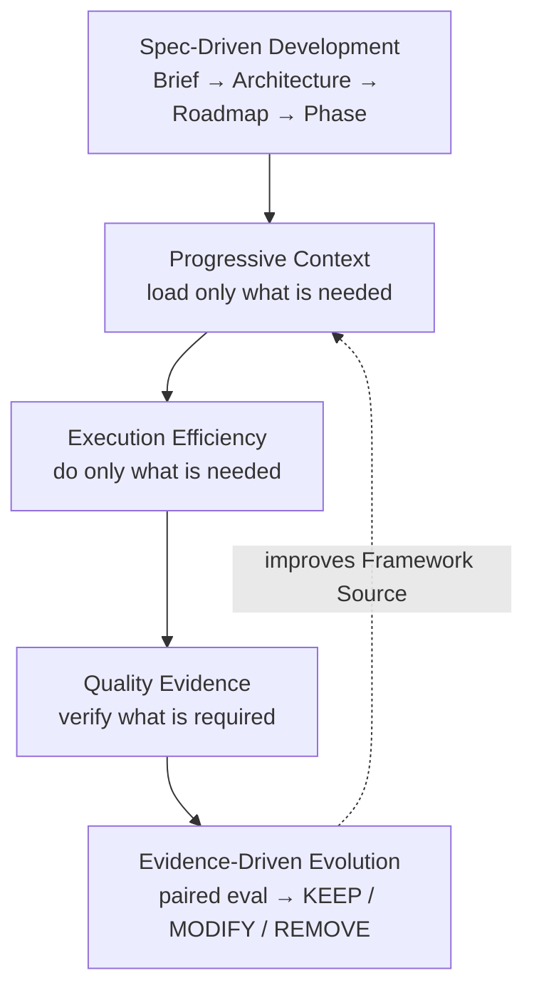
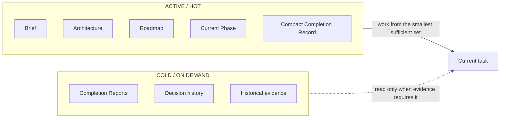
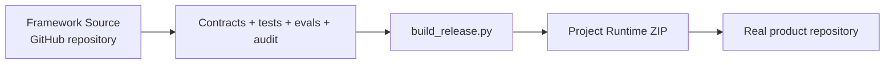
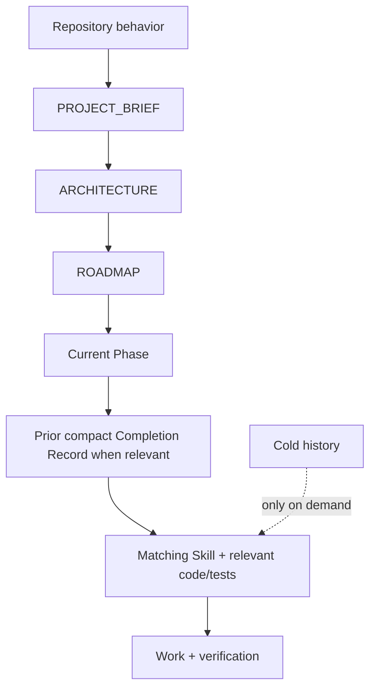

# Progressive Context Kit

**Token-Efficient · Quality-First · Spec-Driven**

[](https://github.com/Elguajo/Progressive-Context-Kit/releases/latest)
[](LICENSE)
[](CONTRIBUTING.md)

> 🇷🇺 Русская версия: [`README_RU.md`](README_RU.md) · detailed guide: [`docs/human/GETTING_STARTED.md`](docs/human/GETTING_STARTED.md)

A token-efficient, quality-first, Spec-Driven development framework for AI coding agents. Progressive Context minimizes active context and execution waste while preserving project knowledge, engineering rigor, continuity, and verifiable correctness.

> **Minimize active context, not available knowledge.**

The goal is not to make prompts, documentation, or validation smaller at any cost. The goal is to make the **active working set and execution path as small as correctness allows**.

Progressive Context combines four ideas:

1. **Spec-Driven Development** — durable Brief → Architecture → Roadmap → Phase → Acceptance → Completion.
2. **Progressive Context** — load only the project knowledge and behavior needed for the current task.
3. **Execution Efficiency** — avoid redundant reconnaissance, reads, environment probes, validation loops, repeated failed approaches, and empty polling.
4. **Evidence-Driven Evolution** — measure workflow changes with controlled paired evaluations and keep, modify, or remove them through the Autoresearch loop.

Correctness, safety, security, acceptance criteria, and required validation always outrank token or execution savings.

New to terms such as `PC-012`, ADR, Default Read Set, Completion Record, or `NEXT_SESSION`? See the human-only [`Glossary`](docs/human/GLOSSARY.md).

## Contents

- [Core model](#core-model)
- [Start here — most users](#start-here--most-users)
- [One framework, two surfaces](#one-framework-two-surfaces)
- [Understand the model](#understand-the-model)
- [Framework Source](#framework-source)
- [Build the Project Runtime](#build-the-project-runtime)
- [Personal profile — optional advanced setup](#personal-profile--optional-advanced-setup)
- [Runtime context model](#runtime-context-model)
- [Adaptive planning depth](#adaptive-planning-depth)
- [Execution efficiency](#execution-efficiency)
- [Measurement and Autoresearch](#measurement-and-autoresearch)
- [Preferred tooling](#preferred-tooling)
- [Verify Framework Source](#verify-framework-source)
- [Verify a Project Runtime](#verify-a-project-runtime)
- [License](#license)
- [Contributing](#contributing)

## Core model



The user-facing development loop remains Spec-Driven and quality-first. Measurement, benchmark, and Autoresearch infrastructure exist to improve the framework itself; they are **Framework Source-only** and do not become normal Project Runtime context.

The practical north star can be read as:

> **Load only what is needed. Do only what is needed. Preserve everything needed for correctness.**



## Start here — most users

Do **not** copy this whole repository into your product.

This repository is the **Framework Source** used to develop, test, measure, document, and release Progressive Context Kit itself.

For a new project, download the latest stable release asset from **GitHub Releases**:

**`Progressive-Context-Project-Runtime-v2.0.0.zip`**

https://github.com/Elguajo/Progressive-Context-Kit/releases/latest

The `main` branch may contain unreleased framework-development, evaluation, benchmark, and Autoresearch changes. The release asset is the stable user-facing Project Runtime.

The Project Runtime is intentionally small and self-contained. After extraction, Progressive occupies only standard agent entrypoints plus hidden framework directories:

```text
my-project/
├── .agents/                  # agent Skills
├── .claude/                  # Claude Code Skills
├── .progressive/             # Progressive project memory + runtime
├── AGENTS.md                 # repository router
├── CLAUDE.md                 # Claude adapter
└── <your application files>
```

You will **not** get visible framework folders such as `global/`, `integrations/`, `profiles/`, `prompts/`, `templates/`, `tools`, or `docs/` in the product root.

The default Project Runtime uses the **Standalone profile**, so a new user can extract it and start Claude Code or Codex without first configuring home-level global instructions.

Start a new project with:

```text
Use .progressive/prompts/START_NEW_PROJECT.md.

My idea:
<describe the desired product, users, real constraints, and explicit non-goals>
```

Visual onboarding: [`docs/visuals/user-onboarding.md`](docs/visuals/user-onboarding.md).

For an existing product repository, do not unpack a Runtime ZIP over project-owned files. Use the adoption path in [`docs/human/GETTING_STARTED.md`](docs/human/GETTING_STARTED.md#10-existing-projects) from a trusted Framework Source checkout instead.

## One framework, two surfaces



The Runtime is **generated from this repository**. It is not maintained as a second independent kit, so the two surfaces cannot intentionally drift.

Framework research infrastructure — real-agent evaluation protocols, benchmark fixtures, paired analyzers, and Autoresearch records — stays on the Source side of this boundary.

## Understand the model

Human-only conceptual guides:

- [`Glossary and terminology`](docs/human/GLOSSARY.md)
- [`How Progressive Context works`](docs/human/HOW_PROGRESSIVE_CONTEXT_WORKS.md)
- [`Project memory model`](docs/human/PROJECT_MEMORY_MODEL.md)
- [`Updating Project Runtime safely`](docs/human/UPDATING_RUNTIME.md)
- [`Getting started`](docs/human/GETTING_STARTED.md)

The complete diagram library lives under [`docs/visuals/`](docs/visuals/README.md). These visuals are explanatory, not canonical. They stay in Framework Source only and are **never packaged into Project Runtime**. Rules for adding them live in [`docs/human/VISUAL_EXPLANATIONS.md`](docs/human/VISUAL_EXPLANATIONS.md).

## Framework Source

Use this repository when you want to:

- develop Progressive Context Kit itself;
- change behavior contracts, Skills, protocols, or installers;
- maintain Codex / Claude adapters;
- run migration, framework, and execution-efficiency regression tests;
- run or extend real-agent paired evaluations and the fixed benchmark pack;
- record evidence-driven Autoresearch experiments;
- maintain human documentation and visual explanations;
- build the Project Runtime release.

## Build the Project Runtime

```bash
python3 tools/build_release.py
```

For the current stable release, output is:

```text
dist/Progressive-Context-Project-Runtime-v2.0.0.zip
dist/Progressive-Context-Project-Runtime-v2.0.0.manifest.json
dist/SHA256SUMS.txt
```

`tools/build_release.py` is the canonical release entrypoint: it validates Framework Source — including contracts and Autoresearch record integrity — builds Runtime, audits the extracted Runtime, and writes release metadata. `tools/build_runtime.py` is the lower-level packaging step.

`tools/build_starter.py` remains as a compatibility alias, but **Project Runtime** is the user-facing name from v1.6 onward.

## Personal profile — optional advanced setup

The release Runtime defaults to zero-setup Standalone behavior.

If you deliberately want Personal deployment across many repositories, Framework Source still provides:

- `global/AGENTS.codex.md` → `~/.codex/AGENTS.md`
- `global/CLAUDE.md` → `~/.claude/CLAUDE.md`

Then install with the Personal profile from a trusted Framework Source checkout:

```bash
python3 tools/init_project.py /path/to/project --profile personal --agent both --dry-run
python3 tools/init_project.py /path/to/project --profile personal --agent both
```

The installer never modifies home-level agent configuration automatically.

## Runtime context model

Normal product work progressively routes:



Completed phases, detailed completion reports, framework history, human docs, visual explanations, migration evidence, evaluation corpora, benchmark fixtures, Autoresearch records, and framework-development tests remain out of normal warm-up.

This is the core token-efficiency model:

```text
Active Context =
Repository Behavior
+ Current Project Slice
+ Current Task Skill/Protocol
+ Relevant Code / Tests / Evidence
```

not the whole framework, whole project history, every Skill, every decision, and every available document on every turn.

## Adaptive planning depth

Progressive chooses the smallest planning depth that protects the work:

- **DIRECT** for clear, local, low-risk, reversible changes;
- **FOCUSED** for normal multi-file product work;
- **FULL** when uncertainty, architecture, high-risk boundaries, or public contracts make deeper planning worthwhile.

Planning depth controls only how much durable specification is created before implementation. It never relaxes correctness, safety, acceptance criteria, validation, or project-state integrity. See [`docs/system/PLANNING_DEPTH.md`](docs/system/PLANNING_DEPTH.md) for the selection rules.

## Execution efficiency

Progressive Context also optimizes **how the agent works after context is loaded**. Current Framework Source protects execution-efficiency behavior for:

- batching independent repository reconnaissance when practical;
- inspecting the smallest sufficient file/output slices before widening;
- grouping knowable runtime/dependency/tool prerequisites before first execution;
- stopping validation after required checks and acceptance evidence are sufficient;
- changing hypothesis or corrective approach after the same underlying check fails repeatedly;
- avoiding frequent empty polling while long-running commands are still in progress.

These are cost optimizations, not permission to skip engineering work. Required tests, acceptance criteria, security gates, project-state updates, and completion evidence remain authoritative.

## Measurement and Autoresearch

Static contracts prove that a rule exists; they do **not** prove that a model follows it or that it saves tokens.

Framework Source therefore includes controlled real-agent evaluation infrastructure under [`docs/evals/agent/`](docs/evals/agent/README.md):

- [`EXECUTION_EFFICIENCY_PROTOCOL.md`](docs/evals/agent/EXECUTION_EFFICIENCY_PROTOCOL.md) — controlled paired comparison protocol;
- [`RUN_RECORD.schema.json`](docs/evals/agent/RUN_RECORD.schema.json) — canonical per-run measurement record;
- [`benchmark/`](docs/evals/agent/benchmark/README.md) — fixed six-scenario Execution Efficiency experiment pack;
- [`autoresearch/`](docs/evals/agent/autoresearch/README.md) — evidence-driven optimization lifecycle;
- `tools/analyze_agent_eval.py` — paired A/B analyzer;
- `tools/prepare_agent_benchmark.py` — deterministic benchmark materializer;
- `tools/autoresearch.py` — experiment lifecycle and evidence validation.

The Autoresearch loop is:

```text
OBSERVE
  ↓
HYPOTHESIZE
  ↓
ONE PRIMARY CHANGE
  ↓
PAIRED EVAL
  ↓
KEEP / MODIFY / REMOVE
  ↓
DURABLE RECORD
```

A cheaper candidate cannot be kept if the paired quality gate fails. Decided experiments are terminal records; a revised hypothesis becomes a new linked experiment instead of rewriting history.

No universal token-saving percentage is claimed until real paired agent runs support it.

## Preferred tooling

The Framework Source retains **Semble, Serena, RTK, Superpowers, gstack, Context7**, with **GitHub Spec Kit** as conditional Advanced Spec Mode. Tool selection remains task-routed; installed does not mean loaded or invoked.

Visual routing explanation: [`docs/visuals/tool-routing.md`](docs/visuals/tool-routing.md).

## Verify Framework Source

The canonical local verification path is:

```bash
python3 tools/gate.py
```

It runs profile and Skill mirror checks, contracts and invariants, tool-routing checks, Autoresearch record validation, source audits, the context-budget report, and the regression suite. A successful gate verifies Framework Source integrity; it is not empirical proof of model quality.

The canonical release path runs the same gate before packaging:

```bash
python3 tools/build_release.py
```

Run individual validators only to diagnose a failed gate or while deliberately working on one validation surface:

```bash
python3 tools/behavior_contract.py
python3 tools/framework_contract.py
python3 tools/autoresearch.py validate
python3 tools/duplication_audit.py
python3 tools/audit.py
python3 -m unittest discover -s tools/tests -v
```

## Verify a Project Runtime

From an extracted project:

```bash
python3 .progressive/tools/audit.py --root .
python3 .progressive/tools/context_compile.py --root .
```

Static framework contracts, benchmark infrastructure, model-evaluation tooling, and Autoresearch records remain in Framework Source; the Project Runtime carries only runtime integrity, project memory, routing, Skills/protocols, and project execution machinery.

## License

Released under the [MIT License](LICENSE).

## Contributing

See [`CONTRIBUTING.md`](CONTRIBUTING.md) for the canonical-ownership rules, the required
pre-submit checks, and the release-artifact policy for this repository.
