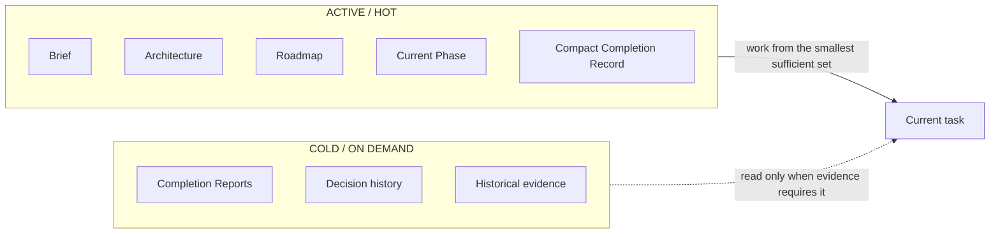
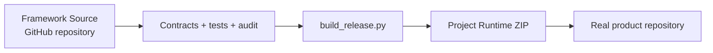
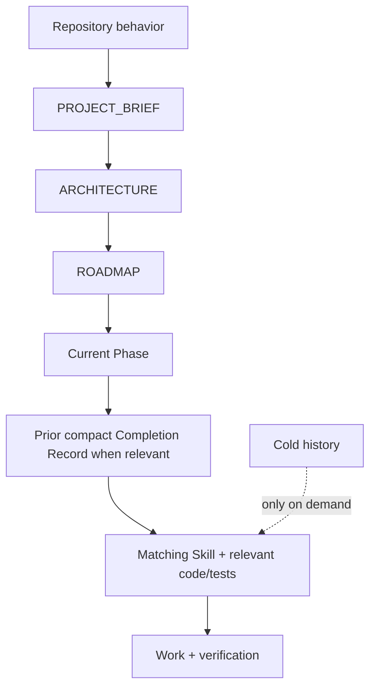

# Progressive Context Kit v1.8.0

**Token-Efficient · Quality-First · Spec-Driven**

> 🇷🇺 Русская версия: [`README_RU.md`](README_RU.md) · detailed guide: [`docs/human/GETTING_STARTED.md`](docs/human/GETTING_STARTED.md)

A development kit for AI coding agents that keeps active context bounded while preserving project knowledge, engineering quality, and Spec-Driven workflow.

> **Minimize active context, not available knowledge.**



## Start here — most users

Do **not** copy this whole repository into your product.

This repository is the **Framework Source** used to develop, test, document, and release Progressive Context Kit itself.

For a new project, download the latest release asset:

**`Progressive-Context-Project-Runtime-v1.8.0.zip`**

from **GitHub Releases**: https://github.com/Elguajo/Progressive-Context-Kit/releases/latest

The Project Runtime is intentionally small and self-contained. After extraction, Progressive occupies only standard agent entrypoints plus hidden framework directories:

```text
my-project/
├── .agents/                  # agent Skills
├── .claude/                  # Claude Code Skills
├── .progressive/             # Progressive project memory + runtime
├── AGENTS.md                 # repository router
├── CLAUDE.md                 # Claude adapter
└── <your application files>
```

You will **not** get visible framework folders such as `global/`, `integrations/`, `profiles/`, `prompts/`, `templates/`, `tools`, or `docs/` in the product root.

The default Project Runtime uses the **Standalone profile**, so a new user can extract it and start Claude Code or Codex without first configuring home-level global instructions.

Start a new project with:

```text
Use .progressive/prompts/START_NEW_PROJECT.md.

My idea:
<describe the desired product, users, real constraints, and explicit non-goals>
```

Visual onboarding: [`docs/visuals/user-onboarding.md`](docs/visuals/user-onboarding.md).

## One framework, two surfaces



The Runtime is **generated from this repository**. It is not maintained as a second independent kit, so the two surfaces cannot intentionally drift.

## Understand the model

Human-only conceptual guides:

- [`How Progressive Context works`](docs/human/HOW_PROGRESSIVE_CONTEXT_WORKS.md)
- [`Project memory model`](docs/human/PROJECT_MEMORY_MODEL.md)
- [`Updating Project Runtime safely`](docs/human/UPDATING_RUNTIME.md)
- [`Getting started`](docs/human/GETTING_STARTED.md)

The complete diagram library lives under [`docs/visuals/`](docs/visuals/README.md). These visuals are explanatory, not canonical. They stay in Framework Source only and are **never packaged into Project Runtime**. Rules for adding them live in [`docs/human/VISUAL_EXPLANATIONS.md`](docs/human/VISUAL_EXPLANATIONS.md).

## Framework Source

Use this repository when you want to:

- develop Progressive Context Kit itself;
- change behavior contracts, Skills, protocols, or installers;
- maintain Codex / Claude adapters;
- run migration and framework regression tests;
- maintain human documentation and visual explanations;
- build the Project Runtime release.

## Build the Project Runtime

```bash
python3 tools/build_release.py
```

Output:

```text
dist/Progressive-Context-Project-Runtime-v1.8.0.zip
dist/Progressive-Context-Project-Runtime-v1.8.0.manifest.json
dist/SHA256SUMS.txt
```

`tools/build_release.py` is the canonical release entrypoint: it validates Framework Source, builds Runtime, audits the extracted Runtime, and writes release metadata. `tools/build_runtime.py` is the lower-level packaging step.

`tools/build_starter.py` remains as a compatibility alias, but **Project Runtime** is the user-facing name from v1.6 onward.

## Personal profile — optional advanced setup

The release Runtime defaults to zero-setup Standalone behavior.

If you deliberately want Personal deployment across many repositories, Framework Source still provides:

- `global/AGENTS.codex.md` → `~/.codex/AGENTS.md`
- `global/CLAUDE.md` → `~/.claude/CLAUDE.md`

Then install with the Personal profile from a trusted Framework Source checkout:

```bash
python3 tools/init_project.py /path/to/project --profile personal --agent both --dry-run
python3 tools/init_project.py /path/to/project --profile personal --agent both
```

The installer never modifies home-level agent configuration automatically.

## Runtime context model

Normal product work progressively routes:



Completed phases, detailed completion reports, framework history, human docs, visual explanations, migration evidence, and framework-development tests remain out of normal warm-up.

## Preferred tooling

The Framework Source retains **Semble, Serena, RTK, Superpowers, gstack, Context7**, with **GitHub Spec Kit** as conditional Advanced Spec Mode. Tool selection remains task-routed; installed does not mean loaded or invoked.

Visual routing explanation: [`docs/visuals/tool-routing.md`](docs/visuals/tool-routing.md).

## Verify Framework Source

```bash
python3 tools/behavior_contract.py
python3 tools/framework_contract.py
python3 tools/duplication_audit.py
python3 tools/audit.py
python3 tools/build_runtime.py
python3 -m unittest discover -s tools/tests -v
```

## Verify a Project Runtime

From an extracted project:

```bash
python3 .progressive/tools/audit.py --root .
python3 .progressive/tools/context_compile.py --root .
```

Static framework gates remain in Framework Source; the Project Runtime carries only runtime integrity and project execution machinery.
