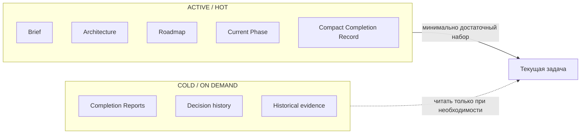
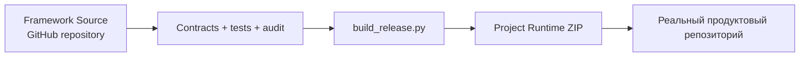
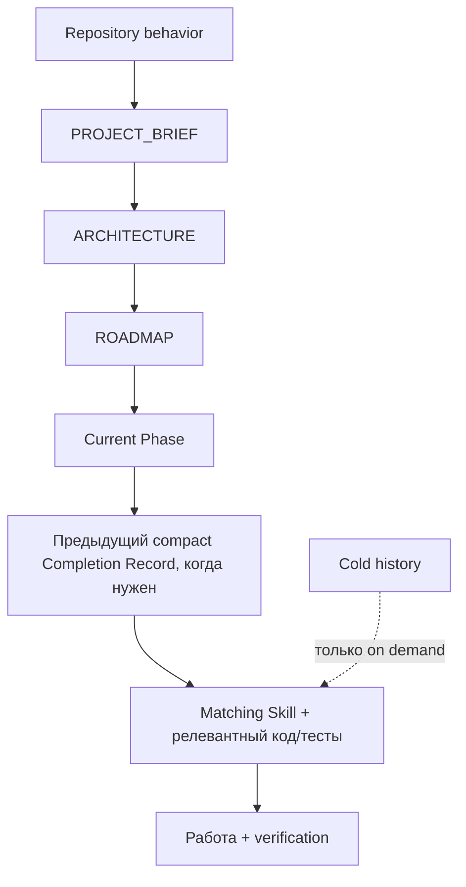

# Progressive Context Kit v1.8.0

**Token-Efficient · Quality-First · Spec-Driven**

[](https://github.com/Elguajo/Progressive-Context-Kit/releases/latest)
[](LICENSE)
[](CONTRIBUTING.md)

> 🇬🇧 English version: [`README.md`](README.md) · подробный гайд: [`docs/human/GETTING_STARTED.ru.md`](docs/human/GETTING_STARTED.ru.md)

**Набор для Spec-Driven разработки с AI coding-агентами, ориентированный на качество и эффективное использование контекста.**

> **Минимизировать активный контекст, а не доступные знания.**

## Содержание

- [С чего начать — для большинства пользователей](#с-чего-начать--для-большинства-пользователей)
- [Один framework — две поверхности](#один-framework--две-поверхности)
- [Понять модель](#понять-модель)
- [Когда нужен Framework Source](#когда-нужен-framework-source)
- [Сборка Project Runtime](#сборка-project-runtime)
- [Personal profile — опционально](#personal-profile--опционально)
- [Runtime context](#runtime-context)
- [Preferred tooling](#preferred-tooling)
- [Проверка Framework Source](#проверка-framework-source)
- [Проверка Project Runtime](#проверка-project-runtime)
- [Лицензия](#лицензия)
- [Как внести вклад](#как-внести-вклад)



## С чего начать — для большинства пользователей

**Не копируй весь этот GitHub-репозиторий в свой проект.**

Этот репозиторий — **Framework Source**: исходники для разработки, тестирования, документации и выпуска Progressive Context Kit.

Чтобы начать новый проект, скачай из GitHub Releases файл:

**`Progressive-Context-Project-Runtime-v1.8.0.zip`**

https://github.com/Elguajo/Progressive-Context-Kit/releases/latest

Project Runtime специально собран так, чтобы framework почти не был виден внутри реального проекта:

```text
my-project/
├── .agents/
├── .claude/
├── .progressive/
├── AGENTS.md
├── CLAUDE.md
└── <файлы самого продукта>
```

В корне проекта не появляются видимые framework-папки `global/`, `integrations/`, `profiles/`, `prompts/`, `templates/`, `tools` и `docs/`.

Project Runtime по умолчанию использует **Standalone profile**. Поэтому новый пользователь может распаковать архив и сразу открыть Claude Code или Codex без предварительной настройки `~/.claude/CLAUDE.md` или `~/.codex/AGENTS.md`.

Первый prompt:

```text
Use .progressive/prompts/START_NEW_PROJECT.md.

My idea:
<опиши продукт, пользователей, реальные ограничения и явные non-goals>
```

Визуальный onboarding: [`docs/visuals/user-onboarding.md`](docs/visuals/user-onboarding.md).

## Один framework — две поверхности



Runtime **генерируется автоматически** из Framework Source. Это не два независимых Kit, поэтому их не нужно синхронизировать вручную.

## Понять модель

Human-only гайды:

- [`Как работает Progressive Context`](docs/human/HOW_PROGRESSIVE_CONTEXT_WORKS.ru.md)
- [`Модель памяти проекта`](docs/human/PROJECT_MEMORY_MODEL.ru.md)
- [`Безопасное обновление Project Runtime`](docs/human/UPDATING_RUNTIME.ru.md)
- [`Быстрый старт`](docs/human/GETTING_STARTED.ru.md)

Полная библиотека схем лежит в [`docs/visuals/`](docs/visuals/README.md). Эти схемы — поясняющий human layer, а не второй source of truth. Они остаются **только во Framework Source и никогда не попадают в Project Runtime**. Правила добавления новых схем: [`docs/human/VISUAL_EXPLANATIONS.md`](docs/human/VISUAL_EXPLANATIONS.md).

## Когда нужен Framework Source

Этот GitHub-репозиторий нужен, если ты:

- развиваешь сам Progressive Context Kit;
- меняешь Skills, contracts, protocols или installer;
- поддерживаешь Claude/Codex adapters;
- работаешь с migration/evaluation evidence;
- запускаешь framework regression tests;
- поддерживаешь human documentation и visual explanations;
- собираешь новый Project Runtime release.

## Сборка Project Runtime

```bash
python3 tools/build_release.py
```

Результат:

```text
dist/Progressive-Context-Project-Runtime-v1.8.0.zip
dist/Progressive-Context-Project-Runtime-v1.8.0.manifest.json
dist/SHA256SUMS.txt
```

`tools/build_release.py` — канонический release entrypoint: проверяет Framework Source, собирает Runtime, аудирует распакованный Runtime и пишет release metadata. `tools/build_runtime.py` — более низкоуровневый шаг упаковки.

Старый `tools/build_starter.py` сохранён как compatibility alias, но начиная с v1.6 пользовательский пакет называется **Project Runtime**.

## Personal profile — опционально

Основной release сделан zero-setup через Standalone profile.

Если ты сознательно используешь Personal deployment на своей машине, Framework Source по-прежнему содержит:

- `global/AGENTS.codex.md` → `~/.codex/AGENTS.md`
- `global/CLAUDE.md` → `~/.claude/CLAUDE.md`

Установка в проект:

```bash
python3 tools/init_project.py /path/to/project --profile personal --agent both --dry-run
python3 tools/init_project.py /path/to/project --profile personal --agent both
```

Installer никогда сам не изменяет home-level agent configuration.

## Runtime context

Обычная работа идёт через:



Завершённые phases, подробные completion reports, human docs, visual explanations, migration evidence и framework-development материалы не должны попадать в обычный warm-up.

## Preferred tooling

Framework Source сохраняет **Semble, Serena, RTK, Superpowers, gstack, Context7**, а **GitHub Spec Kit** используется как условный Advanced Spec Mode. Tool selection остаётся task-routed: installed ≠ loaded.

Визуальная схема routing: [`docs/visuals/tool-routing.md`](docs/visuals/tool-routing.md).

## Проверка Framework Source

```bash
python3 tools/behavior_contract.py
python3 tools/framework_contract.py
python3 tools/duplication_audit.py
python3 tools/audit.py
python3 tools/build_runtime.py
python3 -m unittest discover -s tools/tests -v
```

## Проверка Project Runtime

```bash
python3 .progressive/tools/audit.py --root .
python3 .progressive/tools/context_compile.py --root .
```

## Лицензия

Распространяется по лицензии [MIT](LICENSE).

## Как внести вклад

Правила канонического владения фактами, обязательные проверки перед отправкой изменений и
политика release-артефактов — в [`CONTRIBUTING.md`](CONTRIBUTING.md).
