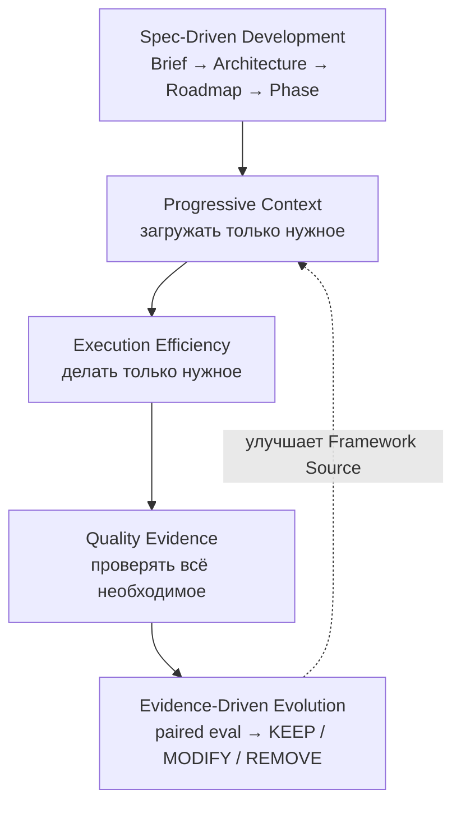
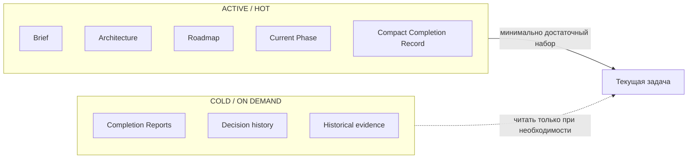
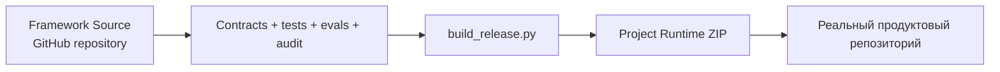
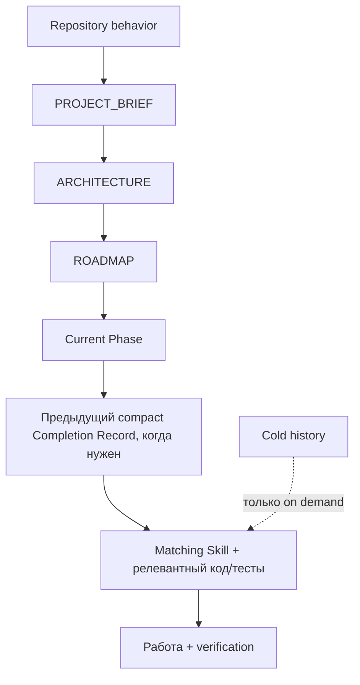

# Progressive Context Kit

**Token-Efficient · Quality-First · Spec-Driven**

[](https://github.com/Elguajo/Progressive-Context-Kit/releases/latest)
[](LICENSE)
[](CONTRIBUTING.md)

> 🇬🇧 English version: [`README.md`](README.md) · подробный гайд: [`docs/human/GETTING_STARTED.ru.md`](docs/human/GETTING_STARTED.ru.md)

Token-efficient, quality-first, Spec-Driven framework для AI coding-агентов. Progressive Context уменьшает активный контекст и лишнюю работу агента, не жертвуя знаниями о проекте, инженерной строгостью, continuity и проверяемой корректностью.

> **Минимизировать активный контекст, а не доступные знания.**

Цель — не сделать prompts, документацию или validation короче любой ценой. Цель — сделать **активный рабочий набор и путь выполнения настолько маленькими, насколько позволяет корректность**.

Progressive Context объединяет четыре идеи:

1. **Spec-Driven Development** — durable Brief → Architecture → Roadmap → Phase → Acceptance → Completion.
2. **Progressive Context** — загружать только знания о проекте и поведение, нужные текущей задаче.
3. **Execution Efficiency** — избегать лишних reconnaissance/read/probe/validation loops, повторения одного и того же неудачного подхода и пустого polling.
4. **Evidence-Driven Evolution** — измерять изменения workflow через controlled paired evaluations и принимать решение `KEEP / MODIFY / REMOVE` через Autoresearch loop.

Correctness, safety, security, acceptance criteria и обязательная validation всегда важнее экономии токенов или шагов.

Если непонятны термины вроде `PC-012`, ADR, Default Read Set, Completion Record или `NEXT_SESSION`, смотри human-only [`Глоссарий`](docs/human/GLOSSARY.ru.md).

## Содержание

- [Основная модель](#основная-модель)
- [С чего начать — для большинства пользователей](#с-чего-начать--для-большинства-пользователей)
- [Один framework — две поверхности](#один-framework--две-поверхности)
- [Понять модель](#понять-модель)
- [Когда нужен Framework Source](#когда-нужен-framework-source)
- [Сборка Project Runtime](#сборка-project-runtime)
- [Personal profile — опционально](#personal-profile--опционально)
- [Runtime context](#runtime-context)
- [Адаптивная глубина планирования](#адаптивная-глубина-планирования)
- [Execution Efficiency](#execution-efficiency)
- [Measurement и Autoresearch](#measurement-и-autoresearch)
- [Preferred tooling](#preferred-tooling)
- [Проверка Framework Source](#проверка-framework-source)
- [Проверка Project Runtime](#проверка-project-runtime)
- [Лицензия](#лицензия)
- [Как внести вклад](#как-внести-вклад)

## Основная модель



Пользовательский development loop остаётся Spec-Driven и quality-first. Measurement, benchmark и Autoresearch существуют для развития самого framework; они остаются **только во Framework Source** и не становятся обычным контекстом Project Runtime.

Практический north star теперь можно читать так:

> **Загружать только нужное. Делать только нужное. Сохранять всё необходимое для корректности.**



## С чего начать — для большинства пользователей

**Не копируй весь этот GitHub-репозиторий в свой проект.**

Этот репозиторий — **Framework Source**: исходники для разработки, тестирования, измерения, документации и выпуска Progressive Context Kit.

Для нового проекта скачай последний стабильный release asset из **GitHub Releases**:

**`Progressive-Context-Project-Runtime-v2.0.0.zip`**

https://github.com/Elguajo/Progressive-Context-Kit/releases/latest

Ветка `main` может содержать ещё не выпущенные framework-development, evaluation, benchmark и Autoresearch изменения. Release asset — стабильный пользовательский Project Runtime.

Project Runtime специально собран так, чтобы framework почти не был виден внутри реального проекта:

```text
my-project/
├── .agents/                  # agent Skills
├── .claude/                  # Claude Code Skills
├── .progressive/             # project memory + runtime
├── AGENTS.md                 # repository router
├── CLAUDE.md                 # Claude adapter
└── <файлы самого продукта>
```

В корне проекта не появляются видимые framework-папки `global/`, `integrations/`, `profiles/`, `prompts/`, `templates/`, `tools` и `docs/`.

Project Runtime по умолчанию использует **Standalone profile**. Поэтому новый пользователь может распаковать архив и сразу открыть Claude Code или Codex без предварительной настройки home-level global instructions.

Первый prompt:

```text
Use .progressive/prompts/START_NEW_PROJECT.md.

My idea:
<опиши продукт, пользователей, реальные ограничения и явные non-goals>
```

Визуальный onboarding: [`docs/visuals/user-onboarding.md`](docs/visuals/user-onboarding.md).

Если продуктовый репозиторий уже существует, не распаковывай Runtime ZIP поверх project-owned файлов. Вместо этого используй путь adoption из [`docs/human/GETTING_STARTED.ru.md`](docs/human/GETTING_STARTED.ru.md#10-existing-projects) в доверенном checkout Framework Source.

## Один framework — две поверхности



Runtime **генерируется автоматически** из Framework Source. Это не два независимых Kit, поэтому их не нужно синхронизировать вручную.

Research infrastructure — real-agent evaluation protocols, benchmark fixtures, paired analyzers и Autoresearch records — остаётся на стороне Framework Source.

## Понять модель

Human-only гайды:

- [`Глоссарий и терминология`](docs/human/GLOSSARY.ru.md)
- [`Как работает Progressive Context`](docs/human/HOW_PROGRESSIVE_CONTEXT_WORKS.ru.md)
- [`Модель памяти проекта`](docs/human/PROJECT_MEMORY_MODEL.ru.md)
- [`Безопасное обновление Project Runtime`](docs/human/UPDATING_RUNTIME.ru.md)
- [`Быстрый старт`](docs/human/GETTING_STARTED.ru.md)

Полная библиотека схем лежит в [`docs/visuals/`](docs/visuals/README.md). Эти схемы — поясняющий human layer, а не второй source of truth. Они остаются **только во Framework Source и никогда не попадают в Project Runtime**. Правила добавления новых схем: [`docs/human/VISUAL_EXPLANATIONS.md`](docs/human/VISUAL_EXPLANATIONS.md).

## Когда нужен Framework Source

Этот GitHub-репозиторий нужен, если ты:

- развиваешь сам Progressive Context Kit;
- меняешь Skills, contracts, protocols или installer;
- поддерживаешь Claude/Codex adapters;
- запускаешь migration, framework и execution-efficiency regression tests;
- запускаешь или расширяешь real-agent paired evaluations и fixed benchmark pack;
- сохраняешь evidence-driven Autoresearch experiments;
- поддерживаешь human documentation и visual explanations;
- собираешь новый Project Runtime release.

## Сборка Project Runtime

```bash
python3 tools/build_release.py
```

Для текущего стабильного release результат:

```text
dist/Progressive-Context-Project-Runtime-v2.0.0.zip
dist/Progressive-Context-Project-Runtime-v2.0.0.manifest.json
dist/SHA256SUMS.txt
```

`tools/build_release.py` — канонический release entrypoint: проверяет Framework Source, включая contracts и целостность Autoresearch records, собирает Runtime, аудирует распакованный Runtime и пишет release metadata. `tools/build_runtime.py` — более низкоуровневый шаг упаковки.

Старый `tools/build_starter.py` сохранён как compatibility alias, но начиная с v1.6 пользовательский пакет называется **Project Runtime**.

## Personal profile — опционально

Основной release сделан zero-setup через Standalone profile.

Если ты сознательно используешь Personal deployment на своей машине, Framework Source по-прежнему содержит:

- `global/AGENTS.codex.md` → `~/.codex/AGENTS.md`
- `global/CLAUDE.md` → `~/.claude/CLAUDE.md`

Установка в проект:

```bash
python3 tools/init_project.py /path/to/project --profile personal --agent both --dry-run
python3 tools/init_project.py /path/to/project --profile personal --agent both
```

Installer никогда сам не изменяет home-level agent configuration.

## Runtime context

Обычная работа идёт через:



Завершённые phases, подробные completion reports, framework history, human docs, visual explanations, migration evidence, evaluation corpora, benchmark fixtures, Autoresearch records и framework-development tests не должны попадать в обычный warm-up.

Основная token-efficiency модель:

```text
Active Context =
Repository Behavior
+ Current Project Slice
+ Current Task Skill/Protocol
+ Relevant Code / Tests / Evidence
```

а не весь framework, вся история проекта, каждый Skill, каждое решение и каждый доступный документ на каждом turn.

## Адаптивная глубина планирования

Progressive выбирает минимальную глубину планирования, достаточную для безопасной работы:

- **DIRECT** — для ясных, локальных, низкорисковых и обратимых изменений;
- **FOCUSED** — для обычной продуктовой работы в нескольких файлах;
- **FULL** — когда глубокое планирование оправдано неопределённостью, архитектурой, high-risk границами или публичными контрактами.

Глубина планирования определяет только объём durable specification до реализации. Она никогда не ослабляет correctness, safety, acceptance criteria, validation или целостность project state. Правила выбора: [`docs/system/PLANNING_DEPTH.md`](docs/system/PLANNING_DEPTH.md).

## Execution Efficiency

Progressive Context оптимизирует не только **что загружается**, но и **как агент работает после загрузки контекста**. Текущий Framework Source защищает поведение для:

- группировки независимого repository reconnaissance, когда это возможно;
- чтения минимально достаточных file/output slices перед расширением области;
- группировки заранее известных runtime/dependency/tool prerequisites перед первым execution;
- остановки validation после достаточных required checks и acceptance evidence;
- смены гипотезы или corrective approach, если одна и та же причина повторно ломает проверку;
- отказа от частого пустого polling во время долгих команд.

Это cost optimizations, а не разрешение пропускать инженерную работу. Required tests, acceptance criteria, security gates, project-state updates и completion evidence остаются обязательными.

## Measurement и Autoresearch

Static contracts доказывают, что правило существует. Они **не доказывают**, что модель следует ему или что оно реально экономит токены.

Поэтому Framework Source содержит controlled real-agent evaluation infrastructure в [`docs/evals/agent/`](docs/evals/agent/README.md):

- [`EXECUTION_EFFICIENCY_PROTOCOL.md`](docs/evals/agent/EXECUTION_EFFICIENCY_PROTOCOL.md) — controlled paired comparison protocol;
- [`RUN_RECORD.schema.json`](docs/evals/agent/RUN_RECORD.schema.json) — canonical per-run measurement record;
- [`benchmark/`](docs/evals/agent/benchmark/README.md) — fixed six-scenario Execution Efficiency experiment pack;
- [`autoresearch/`](docs/evals/agent/autoresearch/README.md) — evidence-driven optimization lifecycle;
- `tools/analyze_agent_eval.py` — paired A/B analyzer;
- `tools/prepare_agent_benchmark.py` — deterministic benchmark materializer;
- `tools/autoresearch.py` — experiment lifecycle и evidence validation.

Autoresearch loop:

```text
OBSERVE
  ↓
HYPOTHESIZE
  ↓
ONE PRIMARY CHANGE
  ↓
PAIRED EVAL
  ↓
KEEP / MODIFY / REMOVE
  ↓
DURABLE RECORD
```

Более дешёвый candidate нельзя сохранить, если paired quality gate провален. Decided experiments — terminal records; новая формулировка гипотезы создаётся как новый linked experiment, а не переписывает историю.

Universal token-saving percentage не заявляется, пока его не подтвердят реальные paired agent runs.

## Preferred tooling

Framework Source сохраняет **Semble, Serena, RTK, Superpowers, gstack, Context7**, а **GitHub Spec Kit** используется как условный Advanced Spec Mode. Tool selection остаётся task-routed: installed ≠ loaded ≠ invoked.

Визуальная схема routing: [`docs/visuals/tool-routing.md`](docs/visuals/tool-routing.md).

## Проверка Framework Source

Канонический локальный путь проверки:

```bash
python3 tools/gate.py
```

Он запускает проверки зеркал profiles и Skills, contracts и invariants, tool routing, записи Autoresearch, Source audit, context-budget report и regression suite. Успешный gate подтверждает целостность Framework Source, но не служит эмпирическим доказательством качества модели.

Канонический release path запускает тот же gate перед упаковкой:

```bash
python3 tools/build_release.py
```

Отдельные validators запускай только для диагностики упавшего gate или при целенаправленной работе над одной поверхностью проверки:

```bash
python3 tools/behavior_contract.py
python3 tools/framework_contract.py
python3 tools/autoresearch.py validate
python3 tools/duplication_audit.py
python3 tools/audit.py
python3 -m unittest discover -s tools/tests -v
```

## Проверка Project Runtime

```bash
python3 .progressive/tools/audit.py --root .
python3 .progressive/tools/context_compile.py --root .
```

Static framework contracts, benchmark infrastructure, model-evaluation tooling и Autoresearch records остаются во Framework Source; Project Runtime содержит только runtime integrity, project memory, routing, Skills/protocols и machinery для выполнения проектных задач.

## Лицензия

Распространяется по лицензии [MIT](LICENSE).

## Как внести вклад

Правила канонического владения фактами, обязательные проверки перед отправкой изменений и
политика release-артефактов — в [`CONTRIBUTING.md`](CONTRIBUTING.md).
