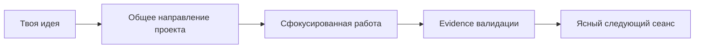

<div align="center">

# Progressive Context Kit

**Token-Efficient · Quality-First · Spec-Driven**

[](https://github.com/Elguajo/Progressive-Context-Kit/releases/latest)
[](https://github.com/Elguajo/Progressive-Context-Kit/actions/workflows/audit.yml)
[](LICENSE)
[](CONTRIBUTING.md)

🇬🇧 English version: [`README.md`](README.md) · подробный гайд: [`docs/human/GETTING_STARTED.ru.md`](docs/human/GETTING_STARTED.ru.md)
</div>

Progressive Context Kit — quality-first framework для AI coding-агентов. Он даёт Codex и Claude Code durable project memory, task-routed guidance и проверяемый workflow без полной загрузки репозитория в каждый сеанс.

> **Минимизировать активный контекст, а не доступные знания.**

## Что даёт framework

- компактную отправную точку для разработки продукта с AI-агентом;
- durable project state, сохраняющееся между отдельными чатами;
- планирование и validation, соответствующие риску и неопределённости задачи;
- самодостаточный Runtime для проектов и отдельно поддерживаемый Framework Source.

## Запуск за 2 минуты

Для нового продукта:

1. [Скачай последний Project Runtime](https://github.com/Elguajo/Progressive-Context-Kit/releases/latest) и распакуй его в каталог будущего проекта.
2. Открой этот каталог в Codex или Claude Code. Runtime самодостаточен по умолчанию: глобальная настройка не требуется.
3. Отправь первый prompt:

   ```text
   Use .progressive/prompts/START_NEW_PROJECT.md.

   My idea:
   <опиши продукт, пользователей, реальные ограничения и явные non-goals>
   ```

Текущий стабильный asset: `Progressive-Context-Project-Runtime-v2.0.0.zip`.

Если продуктовый репозиторий уже существует, не распаковывай Runtime ZIP поверх project-owned файлов. Вместо этого используй [путь adoption](docs/human/GETTING_STARTED.ru.md#10-existing-projects) в доверенном checkout Framework Source.

## Кому подходит

Используй Progressive Context, когда AI coding-агенты помогают разрабатывать или поддерживать реальный программный проект и нужно, чтобы решения, прогресс и evidence валидации сохранялись за пределами одного чата. Он рассчитан на проекты, которым полезны явные границы scope, task-routed инструкции и компактная durable-память о проекте.

Это не замена CI/CD, таск-трекера, контроля версий, security review или командной документации. Framework добавляет agent-facing слой выполнения и continuity рядом с этими системами.

## Сравнение с одним `AGENTS.md`

Одного `AGENTS.md` достаточно для маленького стабильного репозитория. Progressive Context сохраняет привычный entrypoint, но упрощает возобновление и проверку более крупной или длительной работы.

| Задача | Один большой `AGENTS.md` | Progressive Context |
| --- | --- | --- |
| Активные инструкции | Один документ содержит универсальные и условные правила. | Router остаётся компактным; нужные Skills и protocols загружаются только для подходящей задачи. |
| Continuity проекта | В основном опирается на текущий чат и историю репозитория. | Durable project state делает следующий task или session явным. |
| Планирование изменений | Обычно определяется заново в prompt. | Глубина планирования соответствует риску, неопределённости и scope. |
| Проверка | Ожидания существуют в prose. | Task-relevant validation создаёт проверяемое evidence. |

## FAQ

**Нужен ли Git?** Нет. Runtime можно распаковать и начать работу без него. Но для реального продукта Git настоятельно рекомендуется: он сохраняет историю изменений и поддерживает совместную работу.

**Нужна ли глобальная настройка?** Нет. Standalone Runtime по умолчанию содержит нужные repository-level инструкции и Skills. Personal deployment — опциональный режим для тех, кто сознательно использует один глобальный engineering layer в нескольких репозиториях.

**Можно ли добавить его в существующий проект?** Да: используй `tools/init_project.py --adopt-existing` из доверенного checkout Framework Source. Сначала запусти его с `--dry-run`; не распаковывай Runtime archive поверх существующего проекта.

**Что хранится в `.progressive/`?** Runtime tools и prompts, а также project memory, phases, completion history и consequential decisions. Project-owned state сохраняется при обновлении framework.

## Как это работает

**Runtime, а не ещё одна куча файлов.** Продукт получает небольшой самодостаточный workspace для агента. Большой Framework Source остаётся отдельно, поэтому материалы для развития framework не засоряют проект.

**Память проекта, а не более длинный чат.** Агент сохраняет цель продукта, текущую архитектуру, roadmap, прогресс и handoff в durable project state. Новый сеанс продолжает работу с этого состояния, а не восстанавливает её из истории разговора.

**Планирование пропорционально решению.** Ясное локальное изменение идёт прямым путём; обычная продуктовая работа получает focused planning; рискованная или далеко идущая работа — более глубокую подготовку. Каждый путь всё равно требует подходящей validation.

**Evidence качества вместо оптимистичных обещаний.** Обязательные тесты, acceptance criteria, safety checks и обновление project state всегда важнее экономии токенов или шагов.

## От идеи до следующего сеанса



1. **Опиши результат.** Расскажи о продукте, его пользователях, реальных ограничениях и non-goals. Не нужно заранее выбирать каждый framework или структуру папок.
2. **Зафиксируй общее направление.** Агент превращает значимые продуктовые решения в небольшой durable plan, а не оставляет их разбросанными по сообщениям чата.
3. **Работай сфокусированными частями.** Агент загружает инструкции и знания о проекте, подходящие текущей задаче, затем реализует и проверяет результат.
4. **Сохраняй evidence вместе с работой.** Результаты validation, существенные решения и завершённые outcomes остаются доступными, когда понадобятся позже.
5. **Продолжай без повторных объяснений.** Следующий сеанс начинает работу с явного handoff и актуального project state, а не с пустого prompt.

Ты задаёшь желаемый результат, ограничения и существенные продуктовые решения. Агент отвечает за обычную context routing, поддержку project state, implementation, validation и полезный handoff. Он должен запросить направление, когда решение high-risk или существенно меняет продукт, compatibility, architecture либо operational cost.

## Подробнее

- [`Быстрый старт`](docs/human/GETTING_STARTED.ru.md) — установка, adoption и первый сеанс.
- [`Технический справочник`](docs/human/TECHNICAL_REFERENCE.ru.md) — Runtime architecture, project state, profiles, validation и сопровождение Framework Source.
- [`Как работает Progressive Context`](docs/human/HOW_PROGRESSIVE_CONTEXT_WORKS.ru.md) и [`модель памяти проекта`](docs/human/PROJECT_MEMORY_MODEL.ru.md).
- [`Глоссарий`](docs/human/GLOSSARY.ru.md) и [`безопасное обновление Runtime`](docs/human/UPDATING_RUNTIME.ru.md).

## Вклад в проект

Этот репозиторий предназначен для разработки самого Progressive Context Kit. Правила вкладов и канонический путь проверки: [`CONTRIBUTING.md`](CONTRIBUTING.md).

## Безопасность

Политика безопасности проекта: [`SECURITY.md`](SECURITY.md).

## Лицензия

Распространяется по лицензии [MIT](LICENSE).
