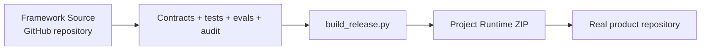
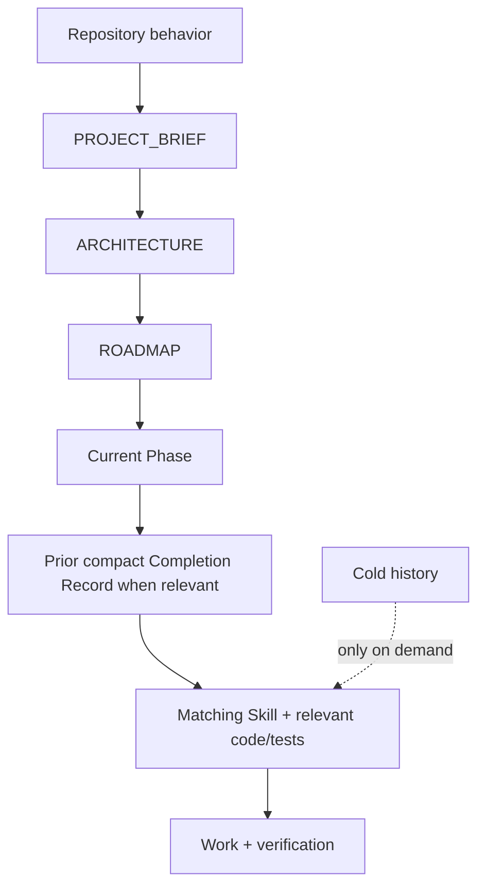

# Progressive Context Kit — Technical Reference

> **Human-only technical reference.** This file belongs to Framework Source and is deliberately excluded from the Project Runtime release.
>
> Russian version: [`TECHNICAL_REFERENCE.ru.md`](TECHNICAL_REFERENCE.ru.md)

This reference is for people integrating, maintaining, or extending Progressive Context Kit. For a first installation, start with [`GETTING_STARTED.md`](GETTING_STARTED.md).

## Contents

- [Runtime and Framework Source](#runtime-and-framework-source)
- [Runtime layout](#runtime-layout)
- [Project context and planning](#project-context-and-planning)
- [Profiles](#profiles)
- [Framework Source tooling and verification](#framework-source-tooling-and-verification)
- [Measurement and Autoresearch](#measurement-and-autoresearch)

## Runtime and Framework Source

Progressive Context has two deliberately separate surfaces:



- **Framework Source** is this repository. It owns behavior contracts, Skills, tooling, tests, documentation, release preparation, and research infrastructure.
- **Project Runtime** is the generated user-facing artifact. It is self-contained and should not be manually patched as a second source of truth.

Build the Runtime from Framework Source with:

```bash
python3 tools/build_release.py
```

The build produces versioned release metadata:

```text
dist/Progressive-Context-Project-Runtime-vX.Y.Z.zip
dist/Progressive-Context-Project-Runtime-vX.Y.Z.manifest.json
dist/SHA256SUMS.txt
```

`tools/build_starter.py` remains a compatibility alias; Project Runtime is the user-facing name.

## Runtime layout

After extraction, a project receives standard agent entrypoints plus hidden framework material:

```text
my-project/
├── .agents/                  # agent Skills
├── .claude/                  # Claude Code Skills
├── .progressive/             # project memory + Runtime
├── AGENTS.md                 # repository router
├── CLAUDE.md                 # Claude adapter
└── <your application files>
```

Visible Framework Source folders such as `global/`, `integrations/`, `profiles/`, `prompts/`, `templates/`, `tools`, and `docs/` are not copied into the product root.

`.progressive/` contains Runtime tools, prompts, templates, system protocols, integrations, and project-owned state. Framework updates preserve project-owned `project/`, `phases/`, `completions/`, and `decisions/` data.

Verify an extracted Runtime with:

```bash
python3 .progressive/tools/audit.py --root .
python3 .progressive/tools/context_compile.py --root .
```

## Project context and planning

Normal work uses the smallest sufficient context:



Completed phases, detailed completion reports, historical evidence, human documentation, and framework research stay cold unless the task requires them.

Choose the smallest planning depth that protects the work:

- **DIRECT** — clear, local, low-risk, reversible changes;
- **FOCUSED** — normal multi-file product work;
- **FULL** — material uncertainty, architecture choices, high-risk boundaries, or public contracts.

Planning depth changes only the amount of durable specification created before implementation. It never relaxes correctness, safety, acceptance criteria, validation, or project-state integrity. Full selection rules: [`../system/PLANNING_DEPTH.md`](../system/PLANNING_DEPTH.md).

## Profiles

The release Runtime defaults to the zero-setup **Standalone** profile. It works at repository scope without home-level configuration.

**Personal** deployment is optional for users who deliberately share one global engineering layer across multiple repositories:

- `global/AGENTS.codex.md` → `~/.codex/AGENTS.md`
- `global/CLAUDE.md` → `~/.claude/CLAUDE.md`

Install the Personal profile from a trusted Framework Source checkout:

```bash
python3 tools/init_project.py /path/to/project --profile personal --agent both --dry-run
python3 tools/init_project.py /path/to/project --profile personal --agent both
```

The installer never modifies home-level agent configuration automatically.

## Framework Source tooling and verification

Framework Source keeps task-routed preferred implementations for semantic discovery, symbol navigation, compact shell output, engineering discipline, browser QA, current API documentation, and optional advanced spec work. The current adapters are Semble, Serena, RTK, Superpowers, gstack, Context7, and conditional GitHub Spec Kit. Installed tools are not automatically loaded or used.

The canonical local source check is:

```bash
python3 tools/gate.py
```

It runs profile and Skill mirror checks, contracts and invariants, routing and tool-adapter checks, Autoresearch record validation, source audits, the context-budget report, and the regression suite. A Gate PASS proves Framework Source static and integrity checks; it is not empirical proof of model quality.

Run individual validators only to diagnose a failed gate or while deliberately working on one validation surface:

```bash
python3 tools/behavior_contract.py
python3 tools/framework_contract.py
python3 tools/autoresearch.py validate
python3 tools/duplication_audit.py
python3 tools/audit.py
python3 -m unittest discover -s tools/tests -v
```

## Measurement and Autoresearch

Static contracts prove that a rule exists; they do not establish that an agent follows it or that it saves resources. Framework Source therefore keeps controlled paired evaluation and Autoresearch infrastructure under [`../evals/agent/`](../evals/agent/README.md).

The loop is:

```text
OBSERVE → HYPOTHESIZE → ONE PRIMARY CHANGE → PAIRED EVAL → KEEP / MODIFY / REMOVE → DURABLE RECORD
```

A cheaper candidate cannot be kept when its paired quality gate fails. Decided experiments are terminal records; a revised hypothesis becomes a new linked experiment rather than rewriting history.
