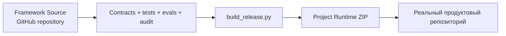
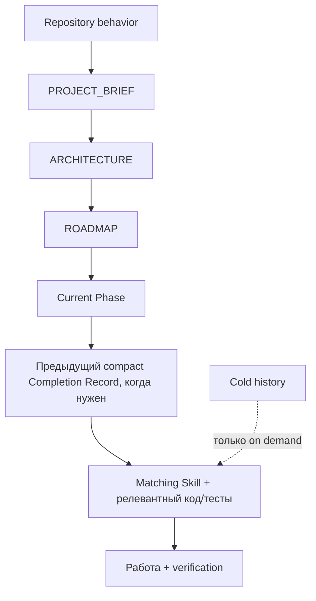

# Progressive Context Kit — Технический справочник

> **Технический справочник только для человека.** Этот файл принадлежит Framework Source и намеренно исключён из Project Runtime.
>
> English version: [`TECHNICAL_REFERENCE.md`](TECHNICAL_REFERENCE.md)

Этот справочник предназначен для интеграции, сопровождения и развития Progressive Context Kit. Для первой установки начни с [`GETTING_STARTED.ru.md`](GETTING_STARTED.ru.md).

## Содержание

- [Runtime и Framework Source](#runtime-и-framework-source)
- [Структура Runtime](#структура-runtime)
- [Контекст проекта и планирование](#контекст-проекта-и-планирование)
- [Profiles](#profiles)
- [Инструменты и проверка Framework Source](#инструменты-и-проверка-framework-source)
- [Measurement и Autoresearch](#measurement-и-autoresearch)

## Runtime и Framework Source

У Progressive Context есть две намеренно разделённые поверхности:



- **Framework Source** — этот репозиторий. Он владеет behavior contracts, Skills, tooling, tests, документацией, подготовкой release и исследовательской инфраструктурой.
- **Project Runtime** — генерируемый пользовательский артефакт. Он самодостаточен и не должен вручную поддерживаться как второй source of truth.

Собрать Runtime из Framework Source:

```bash
python3 tools/build_release.py
```

Сборка создаёт versioned release metadata:

```text
dist/Progressive-Context-Project-Runtime-vX.Y.Z.zip
dist/Progressive-Context-Project-Runtime-vX.Y.Z.manifest.json
dist/SHA256SUMS.txt
```

`tools/build_starter.py` остаётся compatibility alias; пользовательский пакет называется Project Runtime.

## Структура Runtime

После распаковки проект получает обычные точки входа агентов и скрытый framework material:

```text
my-project/
├── .agents/                  # agent Skills
├── .claude/                  # Claude Code Skills
├── .progressive/             # project memory + Runtime
├── AGENTS.md                 # repository router
├── CLAUDE.md                 # Claude adapter
└── <файлы самого продукта>
```

В корень продукта не копируются видимые папки Framework Source: `global/`, `integrations/`, `profiles/`, `prompts/`, `templates/`, `tools` и `docs/`.

`.progressive/` содержит Runtime tools, prompts, templates, system protocols, integrations и project-owned state. Обновление framework сохраняет project-owned данные в `project/`, `phases/`, `completions/` и `decisions/`.

Проверить распакованный Runtime:

```bash
python3 .progressive/tools/audit.py --root .
python3 .progressive/tools/context_compile.py --root .
```

## Контекст проекта и планирование

Обычная работа использует минимально достаточный контекст:



Завершённые phases, подробные completion reports, historical evidence, human docs и framework research остаются cold, пока задача не потребует их явно.

Выбирай минимальную глубину планирования, которая защищает работу:

- **DIRECT** — ясные, локальные, низкорисковые и обратимые изменения;
- **FOCUSED** — обычная продуктовая работа в нескольких файлах;
- **FULL** — существенная неопределённость, архитектурные выборы, high-risk границы или публичные контракты.

Глубина планирования меняет только объём durable specification до реализации. Она никогда не ослабляет correctness, safety, acceptance criteria, validation или целостность project state. Полные правила выбора: [`../system/PLANNING_DEPTH.md`](../system/PLANNING_DEPTH.md).

## Profiles

Release Runtime по умолчанию использует zero-setup **Standalone** profile. Он работает на уровне репозитория без home-level configuration.

**Personal** deployment опционален для тех, кто сознательно делит один global engineering layer между несколькими репозиториями:

- `global/AGENTS.codex.md` → `~/.codex/AGENTS.md`
- `global/CLAUDE.md` → `~/.claude/CLAUDE.md`

Установить Personal profile из доверенного checkout Framework Source:

```bash
python3 tools/init_project.py /path/to/project --profile personal --agent both --dry-run
python3 tools/init_project.py /path/to/project --profile personal --agent both
```

Installer никогда автоматически не меняет home-level agent configuration.

## Инструменты и проверка Framework Source

Framework Source сохраняет task-routed preferred implementations для semantic discovery, навигации по символам, компактного shell output, engineering discipline, browser QA, свежей API-документации и optional advanced spec work. Текущие adapters: Semble, Serena, RTK, Superpowers, gstack, Context7 и условный GitHub Spec Kit. Установленные tools не загружаются и не запускаются автоматически.

Каноническая локальная проверка Source:

```bash
python3 tools/gate.py
```

Она запускает проверки зеркал profiles и Skills, contracts и invariants, routing и tool adapters, записи Autoresearch, source audits, context-budget report и regression suite. Gate PASS подтверждает static/integrity-проверки Framework Source, но не является эмпирическим доказательством качества модели.

Отдельные validators запускай только для диагностики упавшего gate или при целенаправленной работе над одной поверхностью проверки:

```bash
python3 tools/behavior_contract.py
python3 tools/framework_contract.py
python3 tools/autoresearch.py validate
python3 tools/duplication_audit.py
python3 tools/audit.py
python3 -m unittest discover -s tools/tests -v
```

## Measurement и Autoresearch

Static contracts доказывают существование правила, но не доказывают, что агент ему следует или что оно экономит ресурсы. Поэтому Framework Source содержит controlled paired evaluation и Autoresearch infrastructure в [`../evals/agent/`](../evals/agent/README.md).

Цикл:

```text
OBSERVE → HYPOTHESIZE → ONE PRIMARY CHANGE → PAIRED EVAL → KEEP / MODIFY / REMOVE → DURABLE RECORD
```

Более дешёвый candidate нельзя сохранить, если его paired quality gate не пройден. Decided experiments — terminal records; новая гипотеза создаётся как отдельный linked experiment, а не переписывает историю.
