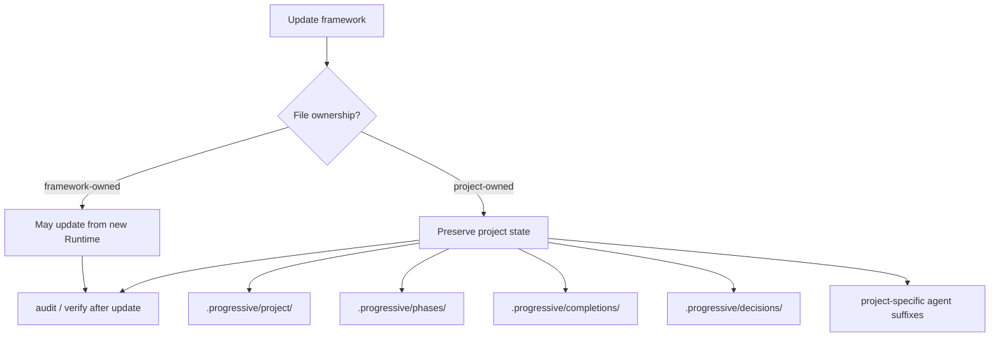

# Framework Update Safety

Human-only explanatory view. Installer behavior and regression tests remain executable sources of truth.

Framework updates may refresh framework-owned machinery, but project-owned knowledge and completion history must survive unchanged.
