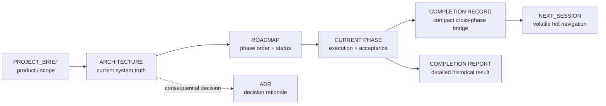

# Layer Ownership Map

Human-only explanatory view. Canonical ownership rules remain in `docs/system/LAYER_OWNERSHIP.md`.

One durable fact should have one canonical owner. Completion reports preserve what happened; they do not replace current Architecture, Brief, Roadmap, or ADR truth.
