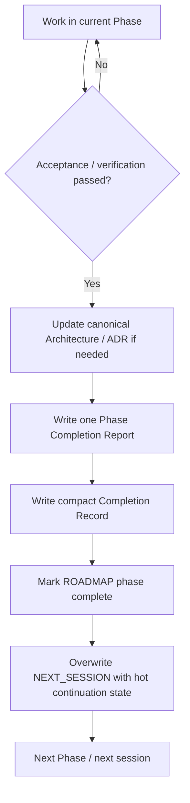

# Phase Completion Lifecycle

Human-only explanatory view. Canonical closeout rules remain in `docs/system/HANDOFF_PROTOCOL.md`.

The detailed report preserves durable history. The compact Completion Record is the cross-phase bridge used by normal context routing.
