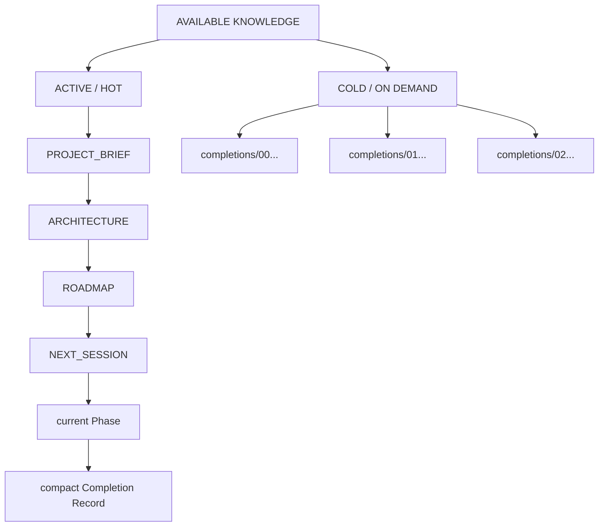

# Progressive Context Overview

Human-only explanatory view. Canonical behavior remains in the framework protocols and context compiler.

The framework minimizes **active context**, not available project knowledge. Detailed completion reports stay available for investigation without becoming part of normal warm-up.
