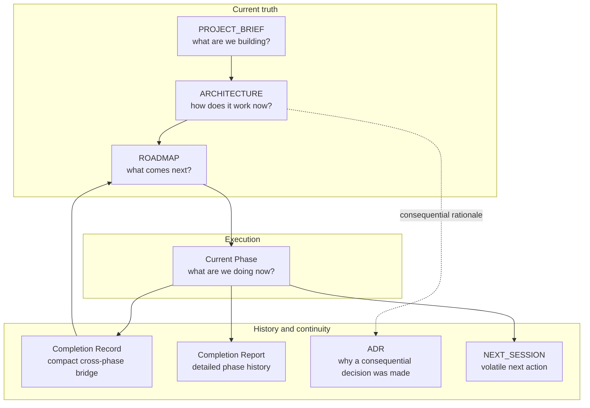

# Project Memory Model

> Human-only explanatory visual. Framework Source only; not packaged into Project Runtime.

Each durable fact should have one canonical owner. Completion reports explain what happened; they do not replace current truth in Brief, Architecture, Roadmap, or ADRs.
