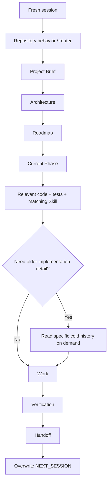

# Session Context Flow

> Human-only explanatory visual. Framework Source only; not packaged into Project Runtime.

Normal startup stays bounded. Detailed historical material is pulled only when evidence requires it.
