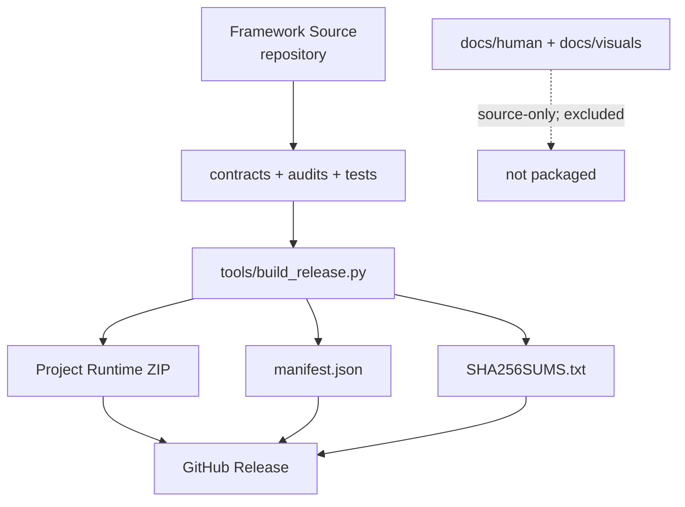

# Framework Source → Project Runtime → Release

Human-only explanatory view. The release builder and workflow remain executable sources of truth.

Project Runtime is generated from Framework Source rather than maintained as a second independent kit. Human documentation can grow without increasing the runtime footprint.
