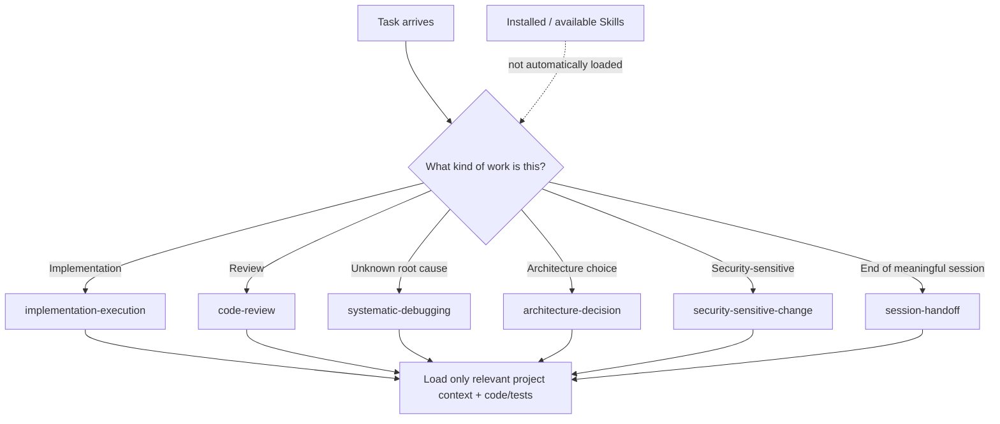

# Tool and Skill Routing

> Human-only explanatory visual. Framework Source only; not packaged into Project Runtime.

**Installed does not mean loaded. Available does not mean active context.** Routing should activate only the workflow support that materially helps the current task.
